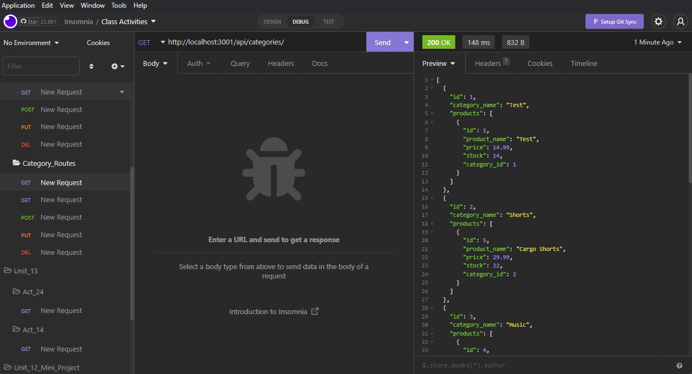

# E-Commerce Tracking

## Back-end application that allows user to manage their inventory database through the different categories, products, and tags for their e-commerce store  

[Demo Video]()

Used 'node' to run application, 'express' for the server, 'mysql' for database management, 'sequelize' for database manipulation, and 'insomnia' to test the request to ensure functionality. 